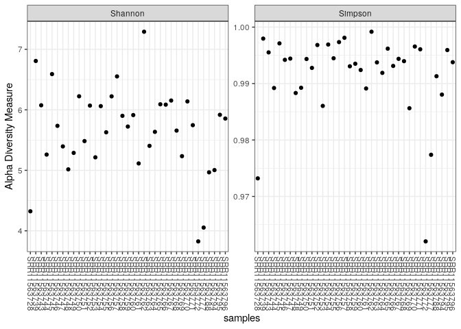

Mexico
================

Planktonic microbial communities from microbialite-bearing lakes sampled
along a salinity-alkalinity gradient

\#Installation des packages et bibliothèques nécessaires

``` r
library(dada2); packageVersion("dada2")
```

    ## Loading required package: Rcpp

    ## [1] '1.28.0'

``` r
install.packages("dplyr")
```

    ## Installing package into '/usr/local/lib/R/site-library'
    ## (as 'lib' is unspecified)

``` r
library(dplyr)
```

    ## 
    ## Attaching package: 'dplyr'

    ## The following objects are masked from 'package:stats':
    ## 
    ##     filter, lag

    ## The following objects are masked from 'package:base':
    ## 
    ##     intersect, setdiff, setequal, union

\#Definition du chemin des données et exploration des fichiers

``` r
path<-"/home/rstudio/Mexico/Data.Brutes"
list.files(path)
```

    ##  [1] "filtered"               "SRR11563728_1.fastq.gz" "SRR11563728_2.fastq.gz"
    ##  [4] "SRR11563739_1.fastq.gz" "SRR11563739_2.fastq.gz" "SRR11563743_1.fastq.gz"
    ##  [7] "SRR11563743_2.fastq.gz" "SRR11563744_1.fastq.gz" "SRR11563744_2.fastq.gz"
    ## [10] "SRR11563745_1.fastq.gz" "SRR11563745_2.fastq.gz" "SRR11563746_1.fastq.gz"
    ## [13] "SRR11563746_2.fastq.gz" "SRR11563747_1.fastq.gz" "SRR11563747_2.fastq.gz"
    ## [16] "SRR11563748_1.fastq.gz" "SRR11563748_2.fastq.gz" "SRR11563749_1.fastq.gz"
    ## [19] "SRR11563749_2.fastq.gz" "SRR11563750_1.fastq.gz" "SRR11563750_2.fastq.gz"
    ## [22] "SRR11563751_1.fastq.gz" "SRR11563751_2.fastq.gz" "SRR11563752_1.fastq.gz"
    ## [25] "SRR11563752_2.fastq.gz" "SRR11563753_1.fastq.gz" "SRR11563753_2.fastq.gz"
    ## [28] "SRR11563754_1.fastq.gz" "SRR11563754_2.fastq.gz" "SRR11563755_1.fastq.gz"
    ## [31] "SRR11563755_2.fastq.gz" "SRR11563756_1.fastq.gz" "SRR11563756_2.fastq.gz"
    ## [34] "SRR11563757_1.fastq.gz" "SRR11563757_2.fastq.gz" "SRR11563758_1.fastq.gz"
    ## [37] "SRR11563758_2.fastq.gz" "SRR11563759_1.fastq.gz" "SRR11563759_2.fastq.gz"
    ## [40] "SRR11563760_1.fastq.gz" "SRR11563760_2.fastq.gz" "SRR11563761_1.fastq.gz"
    ## [43] "SRR11563761_2.fastq.gz" "SRR11563762_1.fastq.gz" "SRR11563762_2.fastq.gz"
    ## [46] "SRR11563763_1.fastq.gz" "SRR11563763_2.fastq.gz" "SRR11563764_1.fastq.gz"
    ## [49] "SRR11563764_2.fastq.gz" "SRR11563765_1.fastq.gz" "SRR11563765_2.fastq.gz"
    ## [52] "SRR11563766_1.fastq.gz" "SRR11563766_2.fastq.gz" "SRR11563767_1.fastq.gz"
    ## [55] "SRR11563767_2.fastq.gz" "SRR11563768_1.fastq.gz" "SRR11563768_2.fastq.gz"
    ## [58] "SRR11563769_1.fastq.gz" "SRR11563769_2.fastq.gz" "SRR11563770_1.fastq.gz"
    ## [61] "SRR11563770_2.fastq.gz" "SRR11563771_1.fastq.gz" "SRR11563771_2.fastq.gz"
    ## [64] "SRR11563772_1.fastq.gz" "SRR11563772_2.fastq.gz" "SRR11563777_1.fastq.gz"
    ## [67] "SRR11563777_2.fastq.gz" "SRR11563788_1.fastq.gz" "SRR11563788_2.fastq.gz"
    ## [70] "SRR11563794_1.fastq.gz" "SRR11563794_2.fastq.gz" "SRR11563795_1.fastq.gz"
    ## [73] "SRR11563795_2.fastq.gz" "SRR11563796_1.fastq.gz" "SRR11563796_2.fastq.gz"

# Chargement des fichiers FASTQ et extraction des noms des échantillons

# Les fichiers de lecture avant (R1) et arrière (R2) sont identifiés selon leur suffixe. Les noms des échantillons sont dérivés des noms de fichiers.

``` r
fnFs<-sort(list.files(path, pattern="_1", full.names=TRUE))
fnRs<-sort(list.files(path, pattern="_2", full.names=TRUE))
fnRs
```

    ##  [1] "/home/rstudio/Mexico/Data.Brutes/SRR11563728_2.fastq.gz"
    ##  [2] "/home/rstudio/Mexico/Data.Brutes/SRR11563739_2.fastq.gz"
    ##  [3] "/home/rstudio/Mexico/Data.Brutes/SRR11563743_2.fastq.gz"
    ##  [4] "/home/rstudio/Mexico/Data.Brutes/SRR11563744_2.fastq.gz"
    ##  [5] "/home/rstudio/Mexico/Data.Brutes/SRR11563745_2.fastq.gz"
    ##  [6] "/home/rstudio/Mexico/Data.Brutes/SRR11563746_2.fastq.gz"
    ##  [7] "/home/rstudio/Mexico/Data.Brutes/SRR11563747_2.fastq.gz"
    ##  [8] "/home/rstudio/Mexico/Data.Brutes/SRR11563748_2.fastq.gz"
    ##  [9] "/home/rstudio/Mexico/Data.Brutes/SRR11563749_2.fastq.gz"
    ## [10] "/home/rstudio/Mexico/Data.Brutes/SRR11563750_2.fastq.gz"
    ## [11] "/home/rstudio/Mexico/Data.Brutes/SRR11563751_2.fastq.gz"
    ## [12] "/home/rstudio/Mexico/Data.Brutes/SRR11563752_2.fastq.gz"
    ## [13] "/home/rstudio/Mexico/Data.Brutes/SRR11563753_2.fastq.gz"
    ## [14] "/home/rstudio/Mexico/Data.Brutes/SRR11563754_2.fastq.gz"
    ## [15] "/home/rstudio/Mexico/Data.Brutes/SRR11563755_2.fastq.gz"
    ## [16] "/home/rstudio/Mexico/Data.Brutes/SRR11563756_2.fastq.gz"
    ## [17] "/home/rstudio/Mexico/Data.Brutes/SRR11563757_2.fastq.gz"
    ## [18] "/home/rstudio/Mexico/Data.Brutes/SRR11563758_2.fastq.gz"
    ## [19] "/home/rstudio/Mexico/Data.Brutes/SRR11563759_2.fastq.gz"
    ## [20] "/home/rstudio/Mexico/Data.Brutes/SRR11563760_2.fastq.gz"
    ## [21] "/home/rstudio/Mexico/Data.Brutes/SRR11563761_2.fastq.gz"
    ## [22] "/home/rstudio/Mexico/Data.Brutes/SRR11563762_2.fastq.gz"
    ## [23] "/home/rstudio/Mexico/Data.Brutes/SRR11563763_2.fastq.gz"
    ## [24] "/home/rstudio/Mexico/Data.Brutes/SRR11563764_2.fastq.gz"
    ## [25] "/home/rstudio/Mexico/Data.Brutes/SRR11563765_2.fastq.gz"
    ## [26] "/home/rstudio/Mexico/Data.Brutes/SRR11563766_2.fastq.gz"
    ## [27] "/home/rstudio/Mexico/Data.Brutes/SRR11563767_2.fastq.gz"
    ## [28] "/home/rstudio/Mexico/Data.Brutes/SRR11563768_2.fastq.gz"
    ## [29] "/home/rstudio/Mexico/Data.Brutes/SRR11563769_2.fastq.gz"
    ## [30] "/home/rstudio/Mexico/Data.Brutes/SRR11563770_2.fastq.gz"
    ## [31] "/home/rstudio/Mexico/Data.Brutes/SRR11563771_2.fastq.gz"
    ## [32] "/home/rstudio/Mexico/Data.Brutes/SRR11563772_2.fastq.gz"
    ## [33] "/home/rstudio/Mexico/Data.Brutes/SRR11563777_2.fastq.gz"
    ## [34] "/home/rstudio/Mexico/Data.Brutes/SRR11563788_2.fastq.gz"
    ## [35] "/home/rstudio/Mexico/Data.Brutes/SRR11563794_2.fastq.gz"
    ## [36] "/home/rstudio/Mexico/Data.Brutes/SRR11563795_2.fastq.gz"
    ## [37] "/home/rstudio/Mexico/Data.Brutes/SRR11563796_2.fastq.gz"

``` r
fnFs
```

    ##  [1] "/home/rstudio/Mexico/Data.Brutes/SRR11563728_1.fastq.gz"
    ##  [2] "/home/rstudio/Mexico/Data.Brutes/SRR11563739_1.fastq.gz"
    ##  [3] "/home/rstudio/Mexico/Data.Brutes/SRR11563743_1.fastq.gz"
    ##  [4] "/home/rstudio/Mexico/Data.Brutes/SRR11563744_1.fastq.gz"
    ##  [5] "/home/rstudio/Mexico/Data.Brutes/SRR11563745_1.fastq.gz"
    ##  [6] "/home/rstudio/Mexico/Data.Brutes/SRR11563746_1.fastq.gz"
    ##  [7] "/home/rstudio/Mexico/Data.Brutes/SRR11563747_1.fastq.gz"
    ##  [8] "/home/rstudio/Mexico/Data.Brutes/SRR11563748_1.fastq.gz"
    ##  [9] "/home/rstudio/Mexico/Data.Brutes/SRR11563749_1.fastq.gz"
    ## [10] "/home/rstudio/Mexico/Data.Brutes/SRR11563750_1.fastq.gz"
    ## [11] "/home/rstudio/Mexico/Data.Brutes/SRR11563751_1.fastq.gz"
    ## [12] "/home/rstudio/Mexico/Data.Brutes/SRR11563752_1.fastq.gz"
    ## [13] "/home/rstudio/Mexico/Data.Brutes/SRR11563753_1.fastq.gz"
    ## [14] "/home/rstudio/Mexico/Data.Brutes/SRR11563754_1.fastq.gz"
    ## [15] "/home/rstudio/Mexico/Data.Brutes/SRR11563755_1.fastq.gz"
    ## [16] "/home/rstudio/Mexico/Data.Brutes/SRR11563756_1.fastq.gz"
    ## [17] "/home/rstudio/Mexico/Data.Brutes/SRR11563757_1.fastq.gz"
    ## [18] "/home/rstudio/Mexico/Data.Brutes/SRR11563758_1.fastq.gz"
    ## [19] "/home/rstudio/Mexico/Data.Brutes/SRR11563759_1.fastq.gz"
    ## [20] "/home/rstudio/Mexico/Data.Brutes/SRR11563760_1.fastq.gz"
    ## [21] "/home/rstudio/Mexico/Data.Brutes/SRR11563761_1.fastq.gz"
    ## [22] "/home/rstudio/Mexico/Data.Brutes/SRR11563762_1.fastq.gz"
    ## [23] "/home/rstudio/Mexico/Data.Brutes/SRR11563763_1.fastq.gz"
    ## [24] "/home/rstudio/Mexico/Data.Brutes/SRR11563764_1.fastq.gz"
    ## [25] "/home/rstudio/Mexico/Data.Brutes/SRR11563765_1.fastq.gz"
    ## [26] "/home/rstudio/Mexico/Data.Brutes/SRR11563766_1.fastq.gz"
    ## [27] "/home/rstudio/Mexico/Data.Brutes/SRR11563767_1.fastq.gz"
    ## [28] "/home/rstudio/Mexico/Data.Brutes/SRR11563768_1.fastq.gz"
    ## [29] "/home/rstudio/Mexico/Data.Brutes/SRR11563769_1.fastq.gz"
    ## [30] "/home/rstudio/Mexico/Data.Brutes/SRR11563770_1.fastq.gz"
    ## [31] "/home/rstudio/Mexico/Data.Brutes/SRR11563771_1.fastq.gz"
    ## [32] "/home/rstudio/Mexico/Data.Brutes/SRR11563772_1.fastq.gz"
    ## [33] "/home/rstudio/Mexico/Data.Brutes/SRR11563777_1.fastq.gz"
    ## [34] "/home/rstudio/Mexico/Data.Brutes/SRR11563788_1.fastq.gz"
    ## [35] "/home/rstudio/Mexico/Data.Brutes/SRR11563794_1.fastq.gz"
    ## [36] "/home/rstudio/Mexico/Data.Brutes/SRR11563795_1.fastq.gz"
    ## [37] "/home/rstudio/Mexico/Data.Brutes/SRR11563796_1.fastq.gz"

``` r
sample.names<-sapply(strsplit(basename(fnFs),split="_"), '[' , 1)
sample.names
```

    ##  [1] "SRR11563728" "SRR11563739" "SRR11563743" "SRR11563744" "SRR11563745"
    ##  [6] "SRR11563746" "SRR11563747" "SRR11563748" "SRR11563749" "SRR11563750"
    ## [11] "SRR11563751" "SRR11563752" "SRR11563753" "SRR11563754" "SRR11563755"
    ## [16] "SRR11563756" "SRR11563757" "SRR11563758" "SRR11563759" "SRR11563760"
    ## [21] "SRR11563761" "SRR11563762" "SRR11563763" "SRR11563764" "SRR11563765"
    ## [26] "SRR11563766" "SRR11563767" "SRR11563768" "SRR11563769" "SRR11563770"
    ## [31] "SRR11563771" "SRR11563772" "SRR11563777" "SRR11563788" "SRR11563794"
    ## [36] "SRR11563795" "SRR11563796"

# Visualisation des profils de qualité des lectures

# Ces graphiques permettent de juger la qualité des lectures avant et arrière pour ajuster les paramètres de filtrage.

``` r
plotQualityProfile(fnFs [c(1, 20, 36)])
```

<!-- -->

``` r
plotQualityProfile(fnRs[c(1, 20, 36)])
```

<!-- --> \# Définition
des chemins pour les fichiers filtrés

``` r
filtFs <- file.path(path, "filtered", paste0(sample.names, "_F_filt.fastq.gz"))
filtRs <- file.path(path, "filtered", paste0(sample.names, "_R_filt.fastq.gz"))
names(filtFs) <- sample.names
names(filtRs) <- sample.names
```

# Filtrage et rognage des séquences

``` r
out <- filterAndTrim(fnFs, filtFs, fnRs, filtRs, truncLen=c(210,160),
              maxN=0, maxEE=c(2,2), truncQ=2, rm.phix=TRUE,
              compress=TRUE, multithread=FALSE)
head(out)
```

    ##                        reads.in reads.out
    ## SRR11563728_1.fastq.gz    19394     17416
    ## SRR11563739_1.fastq.gz   190368    163888
    ## SRR11563743_1.fastq.gz    71121     61040
    ## SRR11563744_1.fastq.gz    72683     63255
    ## SRR11563745_1.fastq.gz    92026     81556
    ## SRR11563746_1.fastq.gz    36277     32483

# Apprentissage des taux d’erreur des séquences

# Les taux d’erreur sont estimés pour les séquences filtrées, ce qui permettra une correction lors des étapes d’inférence.

``` r
errF <- learnErrors(filtFs, multithread=TRUE)
```

    ## 108147270 total bases in 514987 reads from 9 samples will be used for learning the error rates.

``` r
errR <- learnErrors(filtRs, multithread=TRUE)
```

    ## 108811200 total bases in 680070 reads from 10 samples will be used for learning the error rates.

# Visualisation des taux d’erreur

# Ces graphiques comparent les taux d’erreur observés avec ceux attendus

``` r
plotErrors(errF, nominalQ=TRUE)
```

    ## Warning: Transformation introduced infinite values in continuous y-axis
    ## Transformation introduced infinite values in continuous y-axis

<!-- --> \# Inférence
des séquences de haute qualité \# Les algorithmes de DADA2 sont
appliqués aux séquences avant et arrière pour identifier des variants
uniques (ASV)

``` r
dadaFs <- dada(filtFs, err=errF, multithread=TRUE)
```

    ## Sample 1 - 17416 reads in 6905 unique sequences.
    ## Sample 2 - 163888 reads in 49826 unique sequences.
    ## Sample 3 - 61040 reads in 27195 unique sequences.
    ## Sample 4 - 63255 reads in 25093 unique sequences.
    ## Sample 5 - 81556 reads in 34789 unique sequences.
    ## Sample 6 - 32483 reads in 12093 unique sequences.
    ## Sample 7 - 17398 reads in 9238 unique sequences.
    ## Sample 8 - 18309 reads in 6698 unique sequences.
    ## Sample 9 - 59642 reads in 25924 unique sequences.
    ## Sample 10 - 165083 reads in 44338 unique sequences.
    ## Sample 11 - 46169 reads in 13323 unique sequences.
    ## Sample 12 - 40411 reads in 17911 unique sequences.
    ## Sample 13 - 43917 reads in 13876 unique sequences.
    ## Sample 14 - 28404 reads in 12759 unique sequences.
    ## Sample 15 - 27937 reads in 11870 unique sequences.
    ## Sample 16 - 33709 reads in 16443 unique sequences.
    ## Sample 17 - 59739 reads in 30329 unique sequences.
    ## Sample 18 - 42122 reads in 17250 unique sequences.
    ## Sample 19 - 71413 reads in 20708 unique sequences.
    ## Sample 20 - 113687 reads in 33485 unique sequences.
    ## Sample 21 - 21041 reads in 10905 unique sequences.
    ## Sample 22 - 96416 reads in 41574 unique sequences.
    ## Sample 23 - 22614 reads in 10835 unique sequences.
    ## Sample 24 - 73583 reads in 25331 unique sequences.
    ## Sample 25 - 88565 reads in 30834 unique sequences.
    ## Sample 26 - 171777 reads in 50399 unique sequences.
    ## Sample 27 - 89172 reads in 30954 unique sequences.
    ## Sample 28 - 35124 reads in 12005 unique sequences.
    ## Sample 29 - 20782 reads in 9678 unique sequences.
    ## Sample 30 - 46961 reads in 20954 unique sequences.
    ## Sample 31 - 14943 reads in 8683 unique sequences.
    ## Sample 32 - 4299 reads in 2094 unique sequences.
    ## Sample 33 - 2833 reads in 1876 unique sequences.
    ## Sample 34 - 8777 reads in 4932 unique sequences.
    ## Sample 35 - 27089 reads in 6585 unique sequences.
    ## Sample 36 - 26621 reads in 14166 unique sequences.
    ## Sample 37 - 134855 reads in 45068 unique sequences.

``` r
dadaRs <- dada(filtRs, err=errR, multithread=TRUE)
```

    ## Sample 1 - 17416 reads in 6922 unique sequences.
    ## Sample 2 - 163888 reads in 53513 unique sequences.
    ## Sample 3 - 61040 reads in 25600 unique sequences.
    ## Sample 4 - 63255 reads in 23078 unique sequences.
    ## Sample 5 - 81556 reads in 33635 unique sequences.
    ## Sample 6 - 32483 reads in 12098 unique sequences.
    ## Sample 7 - 17398 reads in 8605 unique sequences.
    ## Sample 8 - 18309 reads in 6782 unique sequences.
    ## Sample 9 - 59642 reads in 22964 unique sequences.
    ## Sample 10 - 165083 reads in 48882 unique sequences.
    ## Sample 11 - 46169 reads in 14648 unique sequences.
    ## Sample 12 - 40411 reads in 17099 unique sequences.
    ## Sample 13 - 43917 reads in 13279 unique sequences.
    ## Sample 14 - 28404 reads in 12456 unique sequences.
    ## Sample 15 - 27937 reads in 11570 unique sequences.
    ## Sample 16 - 33709 reads in 16037 unique sequences.
    ## Sample 17 - 59739 reads in 29379 unique sequences.
    ## Sample 18 - 42122 reads in 17524 unique sequences.
    ## Sample 19 - 71413 reads in 20716 unique sequences.
    ## Sample 20 - 113687 reads in 34659 unique sequences.
    ## Sample 21 - 21041 reads in 10844 unique sequences.
    ## Sample 22 - 96416 reads in 42155 unique sequences.
    ## Sample 23 - 22614 reads in 10450 unique sequences.
    ## Sample 24 - 73583 reads in 25212 unique sequences.
    ## Sample 25 - 88565 reads in 30521 unique sequences.
    ## Sample 26 - 171777 reads in 50068 unique sequences.
    ## Sample 27 - 89172 reads in 31428 unique sequences.
    ## Sample 28 - 35124 reads in 12692 unique sequences.
    ## Sample 29 - 20782 reads in 9647 unique sequences.
    ## Sample 30 - 46961 reads in 19902 unique sequences.
    ## Sample 31 - 14943 reads in 8577 unique sequences.
    ## Sample 32 - 4299 reads in 2064 unique sequences.
    ## Sample 33 - 2833 reads in 1903 unique sequences.
    ## Sample 34 - 8777 reads in 5020 unique sequences.
    ## Sample 35 - 27089 reads in 7072 unique sequences.
    ## Sample 36 - 26621 reads in 14226 unique sequences.
    ## Sample 37 - 134855 reads in 47133 unique sequences.

# Affichage des résultats d’inférence pour la première lecture avant

``` r
dadaFs[[1]]
```

    ## dada-class: object describing DADA2 denoising results
    ## 301 sequence variants were inferred from 6905 input unique sequences.
    ## Key parameters: OMEGA_A = 1e-40, OMEGA_C = 1e-40, BAND_SIZE = 16

# Fusion des lectures appariées

# Inspection des données fusionnées pour le premier échantillon

``` r
mergers <- mergePairs(dadaFs, filtFs, dadaRs, filtRs, verbose=TRUE)
```

    ## 15505 paired-reads (in 283 unique pairings) successfully merged out of 16247 (in 457 pairings) input.

    ## 154436 paired-reads (in 3236 unique pairings) successfully merged out of 159295 (in 4840 pairings) input.

    ## 52848 paired-reads (in 1021 unique pairings) successfully merged out of 56493 (in 2372 pairings) input.

    ## 55013 paired-reads (in 1043 unique pairings) successfully merged out of 59861 (in 3075 pairings) input.

    ## 67869 paired-reads (in 1805 unique pairings) successfully merged out of 74314 (in 3889 pairings) input.

    ## 28604 paired-reads (in 730 unique pairings) successfully merged out of 30328 (in 1095 pairings) input.

    ## 13760 paired-reads (in 405 unique pairings) successfully merged out of 15705 (in 1204 pairings) input.

    ## 15039 paired-reads (in 409 unique pairings) successfully merged out of 16591 (in 1047 pairings) input.

    ## 52155 paired-reads (in 793 unique pairings) successfully merged out of 56094 (in 2177 pairings) input.

    ## 153806 paired-reads (in 2664 unique pairings) successfully merged out of 159291 (in 4256 pairings) input.

    ## 41777 paired-reads (in 744 unique pairings) successfully merged out of 43938 (in 1389 pairings) input.

    ## 32697 paired-reads (in 959 unique pairings) successfully merged out of 36917 (in 2786 pairings) input.

    ## 39677 paired-reads (in 730 unique pairings) successfully merged out of 41773 (in 1187 pairings) input.

    ## 22419 paired-reads (in 750 unique pairings) successfully merged out of 25128 (in 1699 pairings) input.

    ## 23547 paired-reads (in 632 unique pairings) successfully merged out of 25275 (in 1134 pairings) input.

    ## 25655 paired-reads (in 869 unique pairings) successfully merged out of 29088 (in 1802 pairings) input.

    ## 47571 paired-reads (in 1473 unique pairings) successfully merged out of 52996 (in 2946 pairings) input.

    ## 35657 paired-reads (in 938 unique pairings) successfully merged out of 38338 (in 1694 pairings) input.

    ## 67673 paired-reads (in 1073 unique pairings) successfully merged out of 69270 (in 1585 pairings) input.

    ## 105952 paired-reads (in 1872 unique pairings) successfully merged out of 109583 (in 3033 pairings) input.

    ## 16154 paired-reads (in 424 unique pairings) successfully merged out of 18049 (in 866 pairings) input.

    ## 78746 paired-reads (in 2754 unique pairings) successfully merged out of 87753 (in 5336 pairings) input.

    ## 18809 paired-reads (in 492 unique pairings) successfully merged out of 20403 (in 857 pairings) input.

    ## 69877 paired-reads (in 1017 unique pairings) successfully merged out of 71677 (in 1557 pairings) input.

    ## 81710 paired-reads (in 1689 unique pairings) successfully merged out of 85177 (in 2908 pairings) input.

    ## 163068 paired-reads (in 2628 unique pairings) successfully merged out of 167715 (in 4249 pairings) input.

    ## 76253 paired-reads (in 1778 unique pairings) successfully merged out of 83356 (in 4738 pairings) input.

    ## 29613 paired-reads (in 866 unique pairings) successfully merged out of 32469 (in 2188 pairings) input.

    ## 16642 paired-reads (in 509 unique pairings) successfully merged out of 18669 (in 978 pairings) input.

    ## 40227 paired-reads (in 1121 unique pairings) successfully merged out of 43687 (in 1956 pairings) input.

    ## 10351 paired-reads (in 436 unique pairings) successfully merged out of 12387 (in 921 pairings) input.

    ## 3263 paired-reads (in 111 unique pairings) successfully merged out of 3605 (in 202 pairings) input.

    ## 1615 paired-reads (in 87 unique pairings) successfully merged out of 1933 (in 157 pairings) input.

    ## 6235 paired-reads (in 260 unique pairings) successfully merged out of 7323 (in 521 pairings) input.

    ## 24597 paired-reads (in 557 unique pairings) successfully merged out of 25791 (in 849 pairings) input.

    ## 21443 paired-reads (in 687 unique pairings) successfully merged out of 23829 (in 1259 pairings) input.

    ## 124090 paired-reads (in 1834 unique pairings) successfully merged out of 129141 (in 3686 pairings) input.

``` r
head(mergers[[1]])
```

    ##                                                                                                                                                                                                                                                                                                                   sequence
    ## 1 CGTGTCTCTAGTGCCAGCCGCCGCGGTAAGACGGAGGAGGCAAGCGTTATCCGGAATTATTGGGCGTAAAGCGTCCGTAGGCGGCTTTTTAAGTCTGTTGTCAAAGCCCACAGCTCAACTGTGGATCGGCAATGGAAACTGGGGAGCTTGAGTGTGGTAGGGGTAGAGGGAATTCCCGGTGTAGCGGTGAAATGCGTAGATATCGGGAAGAACACCAGTGGCGAAGGCGCTCTACTGGGCCACAACTGACGCTGATGGACGAAAGCTAGGGGAGCGAAAGGGATTAGATACCCGTGTAGTCCTAGAGACACG
    ## 2 CGTGTCTCTAGTGCCAGCAGCCGCGGTAAGACGGAGGAGGCAAGCGTTATCCGGAATTATTGGGCGTAAAGCGTCCGTAGGCGGCTTTTTAAGTCTGTTGTCAAAGCCCACAGCTCAACTGTGGATCGGCAATGGAAACTGGGGAGCTTGAGTGTGGTAGGGGTAGAGGGAATTCCCGGTGTAGCGGTGAAATGCGTAGATATCGGGAAGAACACCAGTGGCGAAGGCGCTCTACTGGGCCACAACTGACGCTGATGGACGAAAGCTAGGGGAGCGAAAGGGATTAGATACCCGTGTAGTCCTAGAGACACG
    ## 3 CGTGTCTCTAGGACTACACGGGTATCTAATCCCTTTCGCTCCCCTAGCTTTCGTCCATCAGCGTCAGTTGTGGCCCAGTAGAGCGCCTTCGCCACTGGTGTTCTTCCCGATATCTACGCATTTCACCGCTACACCGGGAATTCCCTCTACCCCTACCACACTCAAGCTCCCCAGTTTCCATTGCCGATCCACAGTTGAGCTGTGGGCTTTGACAACAGACTTAAAAAGCCGCCTACGGACGCTTTACGCCCAATAATTCCGGATAACGCTTGCCTCCTCCGTCTTACCGCGGCGGCTGGCACTAGAGACACG
    ## 4 CGTGTCTCTAGGACTACACGGGTATCTAATCCCTTTCGCTCCCCTAGCTTTCGTCCATCAGCGTCAGTTGTGGCCCAGTAGAGCGCCTTCGCCACTGGTGTTCTTCCCGATATCTACGCATTTCACCGCTACACCGGGAATTCCCTCTACCCCTACCACACTCAAGCTCCCCAGTTTCCATTGCCGATCCACAGTTGAGCTGTGGGCTTTGACAACAGACTTAAAAAGCCGCCTACGGACGCTTTACGCCCAATAATTCCGGATAACGCTTGCCTCCTCCGTCTTACCGCGGCTGCTGGCACTAGAGACACG
    ## 5 CGTGTCTCTAGTGCCAGCCGCCGCGGTAAGACGGAGGAGGCAAGCGTTATCCGGAATTATTGGGCGTAAAGCGTCCGTAGGCGGCTTTTTAAGTCTGTTGTCAAAGCCCACAGCTCAACTGTGGATCGGCAATGGAAACTGGGGAGCTTGAGTGTGGTAGGGGTAGAGGGAATTCCCGGTGTAGCGGTGAAATGCGTAGATATCGGGAAGAACACCAGTGGCGAAGGCGCTCTACTGGGCCACAACTGACGCTGATGGACGAAAGCTAGGGGAGCGAAAGGGATTAGATACCCGCGTAGTCCTAGAGACACG
    ## 6 CGTGTCTCTAGGACTACGCGGGTATCTAATCCCTTTCGCTCCCCTAGCTTTCGTCCATCAGCGTCAGTTGTGGCCCAGTAGAGCGCCTTCGCCACTGGTGTTCTTCCCGATATCTACGCATTTCACCGCTACACCGGGAATTCCCTCTACCCCTACCACACTCAAGCTCCCCAGTTTCCATTGCCGATCCACAGTTGAGCTGTGGGCTTTGACAACAGACTTAAAAAGCCGCCTACGGACGCTTTACGCCCAATAATTCCGGATAACGCTTGCCTCCTCCGTCTTACCGCGGCGGCTGGCACTAGAGACACG
    ##   abundance forward reverse nmatch nmismatch nindel prefer accept
    ## 1       931       1       1     58         0      0      1   TRUE
    ## 2       838       2       1     58         0      0      1   TRUE
    ## 3       824       3       2     58         0      0      2   TRUE
    ## 4       686       3       3     58         0      0      2   TRUE
    ## 5       527       1       4     58         0      0      1   TRUE
    ## 6       439       4       2     58         0      0      2   TRUE

# Construction de la table des ASV (Amplicon Sequence Variants)

``` r
seqtab <- makeSequenceTable(mergers)
dim(seqtab)
```

    ## [1]    37 38807

# Inspection de la distribution des longueurs des séquences

``` r
table(nchar(getSequences(seqtab)))
```

    ## 
    ##   222   240   250   251   279   280   282   283   285   286   299   303   305 
    ##     1     1     1     1     1     6     1     2    12     1     1     8     2 
    ##   306   307   308   309   310   311   312   313   314   315   316   317   322 
    ##     3     4     6     8     9   382 36400  1802    80    41    13     2     1 
    ##   326   331   333   342   347   351 
    ##     7     2     3     4     1     1

# Suppression des chimères

# Les chimères, des artefacts de séquençage, sont éliminées pour obtenir des séquences fiables.

``` r
seqtab.nochim <- removeBimeraDenovo(seqtab, method="consensus", multithread=TRUE, verbose=TRUE)
```

    ## Identified 13948 bimeras out of 38807 input sequences.

``` r
dim(seqtab.nochim)
```

    ## [1]    37 24859

# Calcul du pourcentage de séquences non-chimériques

# Cette étape évalue la proportion de séquences valides restant après suppression des chimères.

``` r
sum(seqtab.nochim)/sum(seqtab)
```

    ## [1] 0.7141652

# Suivi des lectures à travers les étapes

# Un tableau est créé pour suivre le nombre de lectures après chaque étape du pipeline.

``` r
getN <- function(x) sum(getUniques(x))
track <- cbind(out, sapply(dadaFs, getN), sapply(dadaRs, getN), sapply(mergers, getN), rowSums(seqtab.nochim))

colnames(track) <- c("input", "filtered", "denoisedF", "denoisedR", "merged", "nonchim")
rownames(track) <- sample.names
head(track)
```

    ##              input filtered denoisedF denoisedR merged nonchim
    ## SRR11563728  19394    17416     16588     16752  15505   12827
    ## SRR11563739 190368   163888    160870    161641 154436   95768
    ## SRR11563743  71121    61040     57509     58815  52848   45027
    ## SRR11563744  72683    63255     60629     61861  55013   32291
    ## SRR11563745  92026    81556     76254     78173  67869   55224
    ## SRR11563746  36277    32483     30950     31429  28604   23268

``` r
library(phyloseq)
```

# Attribution taxonomique

# Les séquences sont comparées à une base de données (par exemple SILVA) pour attribuer des taxons (espèces, genres, etc.)

``` r
taxa <- assignTaxonomy(seqtab.nochim, "~/Mexico/silva_nr99_v138.2_toGenus_trainset.fa.gz", multithread=TRUE)
```

\#Examen des résultats d’attribution

``` r
taxa.print <- taxa
rownames(taxa.print) <- NULL
head(taxa.print)
```

    ##      Kingdom     Phylum            Class            Order            
    ## [1,] "Bacteria"  "Cyanobacteriota" "Cyanobacteriia" "Phormidesmiales"
    ## [2,] "Bacteria"  "Cyanobacteriota" "Cyanobacteriia" "Phormidesmiales"
    ## [3,] "Eukaryota" NA                NA               NA               
    ## [4,] "Eukaryota" NA                NA               NA               
    ## [5,] "Bacteria"  "Cyanobacteriota" "Cyanobacteriia" "Phormidesmiales"
    ## [6,] "Bacteria"  "Cyanobacteriota" "Cyanobacteriia" "Phormidesmiales"
    ##      Family            Genus                 
    ## [1,] "Nodosilineaceae" "Nodosilinea PCC-7104"
    ## [2,] "Nodosilineaceae" "Nodosilinea PCC-7104"
    ## [3,] NA                NA                    
    ## [4,] NA                NA                    
    ## [5,] "Nodosilineaceae" "Nodosilinea PCC-7104"
    ## [6,] "Nodosilineaceae" "Nodosilinea PCC-7104"

# Chargement des bibliothèques pour la visualisation et la manipulation des données phylogénétiques

``` r
library(phyloseq); packageVersion("phyloseq")
```

    ## [1] '1.44.0'

``` r
library(Biostrings); packageVersion("Biostrings")
```

    ## Loading required package: BiocGenerics

    ## 
    ## Attaching package: 'BiocGenerics'

    ## The following objects are masked from 'package:dplyr':
    ## 
    ##     combine, intersect, setdiff, union

    ## The following objects are masked from 'package:stats':
    ## 
    ##     IQR, mad, sd, var, xtabs

    ## The following objects are masked from 'package:base':
    ## 
    ##     anyDuplicated, aperm, append, as.data.frame, basename, cbind,
    ##     colnames, dirname, do.call, duplicated, eval, evalq, Filter, Find,
    ##     get, grep, grepl, intersect, is.unsorted, lapply, Map, mapply,
    ##     match, mget, order, paste, pmax, pmax.int, pmin, pmin.int,
    ##     Position, rank, rbind, Reduce, rownames, sapply, setdiff, sort,
    ##     table, tapply, union, unique, unsplit, which.max, which.min

    ## Loading required package: S4Vectors

    ## Loading required package: stats4

    ## 
    ## Attaching package: 'S4Vectors'

    ## The following objects are masked from 'package:dplyr':
    ## 
    ##     first, rename

    ## The following object is masked from 'package:utils':
    ## 
    ##     findMatches

    ## The following objects are masked from 'package:base':
    ## 
    ##     expand.grid, I, unname

    ## Loading required package: IRanges

    ## 
    ## Attaching package: 'IRanges'

    ## The following object is masked from 'package:phyloseq':
    ## 
    ##     distance

    ## The following objects are masked from 'package:dplyr':
    ## 
    ##     collapse, desc, slice

    ## Loading required package: XVector

    ## Loading required package: GenomeInfoDb

    ## 
    ## Attaching package: 'Biostrings'

    ## The following object is masked from 'package:base':
    ## 
    ##     strsplit

    ## [1] '2.68.1'

``` r
library(ggplot2); packageVersion("ggplot2")
```

    ## [1] '3.4.3'

# Définition du thème graphique pour les visualisations

``` r
theme_set(theme_bw())
```

# Création d’un tableau de métadonnées basé sur les noms d’échantillons

# On extrait des informations comme le sujet, le genre, et le jour à partir des noms d’échantillons.

``` r
samples.out <- rownames(seqtab.nochim)
subject <- sapply(strsplit(samples.out, "D"), `[`, 1)
gender <- substr(subject,1,1)
subject <- substr(subject,2,999)
day <- as.integer(sapply(strsplit(samples.out, "D"), `[`, 2))
samdf <- data.frame(Subject=subject, Gender=gender, Day=day)
samdf$When <- "Early"
samdf$When[samdf$Day>100] <- "Late"
rownames(samdf) <- samples.out
```

# Création de l’objet Phyloseq

# Cet objet combine les tables ASV, les métadonnées, et les taxonomies pour l’analyse.

``` r
ps <- phyloseq(otu_table(seqtab.nochim, taxa_are_rows=FALSE), 
               sample_data(samdf), 
               tax_table(taxa))
ps <- prune_samples(sample_names(ps) != "Mock", ps)
```

# Ajout des séquences d’ADN aux données Phyloseq

# Les séquences sont renommées en tant qu’ASVs pour simplifier leur identification.

``` r
dna <- Biostrings::DNAStringSet(taxa_names(ps))
names(dna) <- taxa_names(ps)
ps <- merge_phyloseq(ps, dna)
taxa_names(ps) <- paste0("ASV", seq(ntaxa(ps)))
ps
```

    ## phyloseq-class experiment-level object
    ## otu_table()   OTU Table:         [ 24859 taxa and 37 samples ]
    ## sample_data() Sample Data:       [ 37 samples by 4 sample variables ]
    ## tax_table()   Taxonomy Table:    [ 24859 taxa by 6 taxonomic ranks ]
    ## refseq()      DNAStringSet:      [ 24859 reference sequences ]

# Visualisation de la richesse alpha des échantillons

# On trace les indices de diversité Shannon et Simpson en fonction des jours, colorés par la période.

``` r
plot_richness(ps, measures=c("Shannon", "Simpson"))
```

<!-- --> \#
Sauvegarder les tables de séquences dénuées de chimères et la taxonomie
assignée

``` r
save(seqtab.nochim, file="seqtab.nochim.RData")
save(taxa, file="taxa.RData")
```

# Vérifier si le fichier sauvegardé pour la table des séquences existe

``` r
file.exists("seqtab.nochim.RData")
```

    ## [1] TRUE

# Charger les métadonnées

``` r
metadata <- read.csv("SraRunTable.csv", sep = ";" , header=TRUE)
```

# Sélectionner les 300 ASVs les plus abondants pour une visualisation simplifiée

``` r
top20 <- names(sort(taxa_sums(ps), decreasing=TRUE))[1:300]
ps.top20 <- transform_sample_counts(ps, function(Phylum) Phylum/sum(Phylum))
ps.top20 <- prune_taxa(top20, ps.top20)
plot_bar(ps.top20, fill="Phylum")
```

<!-- -->
